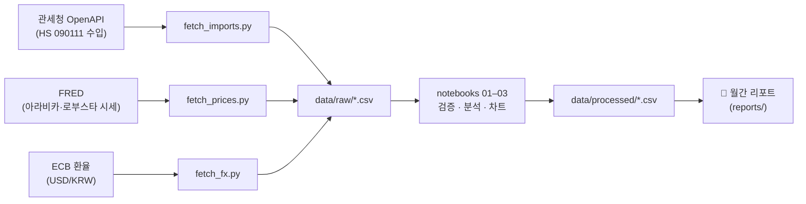

# Coffee & F&B Market Intelligence

> 한국 커피 시장의 월간 인텔리전스 리포트 — 공공데이터 파이프라인으로 수집하고, 검증 가능한 형태로 분석합니다.

**📄 최신 리포트: [2026년 5월호 (v0)](reports/monthly_coffee_market_brief_2026_05.md)** — 수입 통계 · 국제 시세 · 환율 · 원산지 리스크 · 국내 F&B 함의, 7개 섹션

---

## 핵심 발견 (2024-01 ~ 2026-04)

1. **생두 수입 비용 증가는 물량이 아니라 가격이 끌어올렸다.** 수입 물량은 월 ~13,700톤으로 평탄한데, 평균 수입 단가는 $3.88 → $6.87/kg (정점 $7.98)로 약 2배.
2. **그 단가 급등은 국제 아라비카 시세와의 구조적 동행이다** — 레벨 상관 0.87. 단, 차분 상관은 0.08이라 "매월 동조"가 아닌 "장기 동행"으로 해석한다 (허위상관 주의).
3. **환율은 기여도 15%의 2차 증폭이지만, 결정적 국면에 작동했다.** 2025-05 이후 국제 시세가 −7.2% 빠지는 동안 원화 약세(+7.4%)가 하락분을 정확히 상쇄 — 원화 원가는 11,000원/kg대 고점에 고착.
4. **총 수입량이 평탄해도 공급은 안전하지 않다.** 에티오피아 수입은 +13% YoY로 '정상'이지만, 현장에선 워시드 뉴크롭 지연·선계약 집중이 진행 중 — 통관 통계(flow)에 안 잡히는 신호를 데이터 + 업계 보도 삼각측량으로 검증.

| 수입 물량 vs 단가 | 원화 원가 분해 (가격효과 vs 환율효과) |
|---|---|
|  |  |

---

## 파이프라인



- **수집**: 스크립트로 재실행 가능한 자동 수집 (XML/CSV/REST, API 키는 `.env`)
- **검증**: 중복·결측·음수 0건 확인, API 합계행과 국가합 교차검증 (오차 2kg/16,411톤)
- **분석**: 노트북에서 추세·상관·로그 분해, 차트는 `reports/figures/`로 내보내 리포트에 임베드

## 분석 원칙

이 리포트는 "그럴듯한 해석"보다 **반증 가능한 서술**을 우선합니다.

- **레벨 상관 vs 차분 상관을 함께 본다** — 추세를 공유하는 시계열의 상관 부풀림(0.87 vs 0.08)을 분리
- **끝점 민감도를 명시한다** — 단일월 기준 +47% vs 3개월 평균 +65% → "+47~65%"로 범위 표기
- **혼합 단가의 구성효과를 분리한다** — "전부 가격" 대신 "주로 시세, 일부 원산지 구성 변화"
- **다음 달 관찰 포인트에 판단 기준(트리거)을 단다** — "지켜보자"가 아니라 "ET 프리미엄 ≥ +$0.8/kg이면 공급 타이트 지속" 같은 검증 가능한 임계값 (→ [리포트 Section 7](reports/monthly_coffee_market_brief_2026_05.md#7-next-month-watchpoints-다음-달-관찰-포인트))
- **신뢰 수준을 구분한다** — 1차 데이터로 검증된 섹션 / 업계 보도 기반 / 가설 단계를 리포트 안에서 명시

## 이 프로젝트가 보여주는 것

금융 IT BA(5년차, 전직 Java 백엔드)가 **익숙한 도메인 밖에서도 같은 역량이 작동하는지** 검증하기 위한 프로젝트입니다.

| 역량 | 이 저장소에서의 증거 |
|---|---|
| 비정형 정보의 구조화·자산화 | 흩어진 공공데이터 + 현장 루머 → 스키마 정의 → 재실행 가능한 파이프라인 → 의사결정 문서 |
| 데이터 검증·비판적 해석 | 무결성 검증, 교차검증, 허위상관·끝점민감도·구성효과 명시 ([learning_notes](docs/learning_notes.md)) |
| AI 협업 워크플로 | AI를 검색기가 아닌 **비판적 검토 루프의 파트너**로 운용 — 역할 정의는 [CLAUDE.md](CLAUDE.md), 과장된 해석 3건을 AI 편집자 루프로 교정한 기록은 [project_log Day 5](docs/project_log.md) |
| 반복 가능한 운영 사이클 | Day 단위 작업 로그, 월간 갱신을 전제로 한 Watchpoint 트리거 설계 |

실무(코어뱅킹 BA)에서의 같은 역량은 [velog 글들](https://velog.io/@jaeahn91/posts)에 기록하고 있습니다 — 1,500페이지 규정집의 검색 자산화, AI 검증 게이트 설계, 요건 정합성 관리 등.

## 재현 방법

```bash
python -m venv .venv && source .venv/bin/activate
pip install -r requirements.txt

# .env 에 CUSTOMS_API_KEY=<data.go.kr 발급 키>  (FRED·ECB는 키 불필요)
python scripts/fetch_imports.py   # 관세청 수입 데이터
python scripts/fetch_prices.py    # FRED 국제 시세
python scripts/fetch_fx.py        # ECB USD/KRW

# 노트북 01 → 02 → 03 순서로 실행 (처리 데이터·차트 생성)
```

## 폴더 구조

```
├── data/
│   ├── raw/         # 수집 원본 (관세청·FRED·ECB)
│   ├── processed/   # 월별 집계, 원산지 점유율, 원가 분해
│   └── reference/   # 데이터 소스 트래커
├── scripts/         # 데이터 수집 (재실행 가능)
├── notebooks/       # 검증 → 추세 → 교차검증 → FX 분해
├── reports/         # 월간 리포트 + 차트
└── docs/            # 프로젝트 로그, 도메인 노트, 학습 노트
```

---

**작성** [jaeahn91](https://github.com/jaeahn91) · 실무 BA 기록: [velog](https://velog.io/@jaeahn91/posts)
