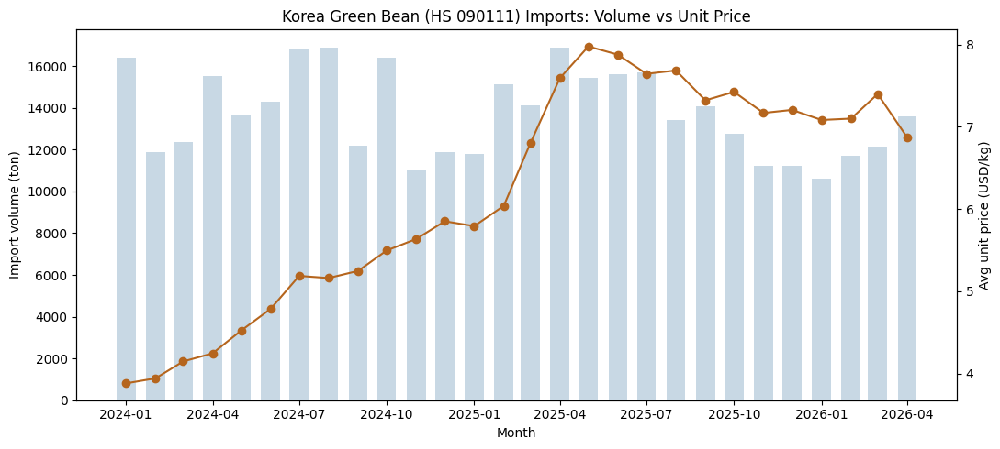
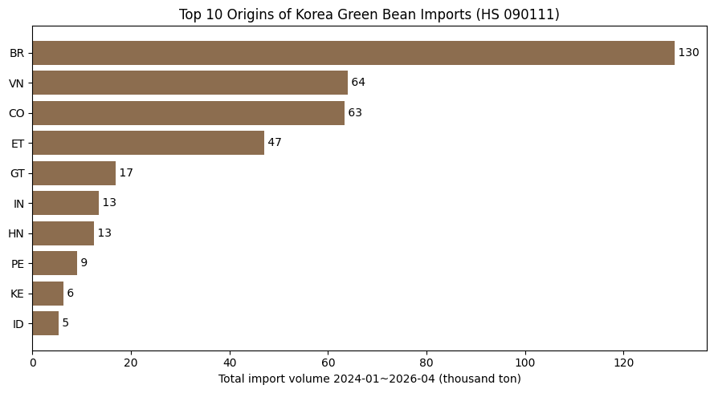
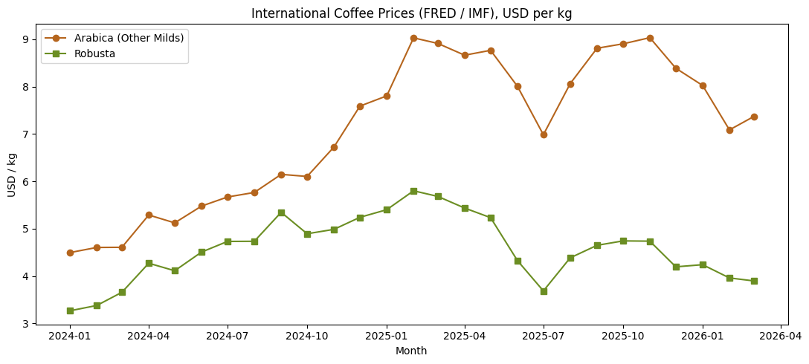
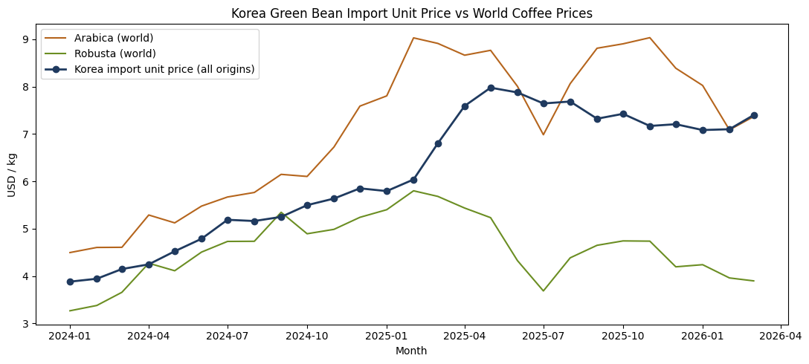
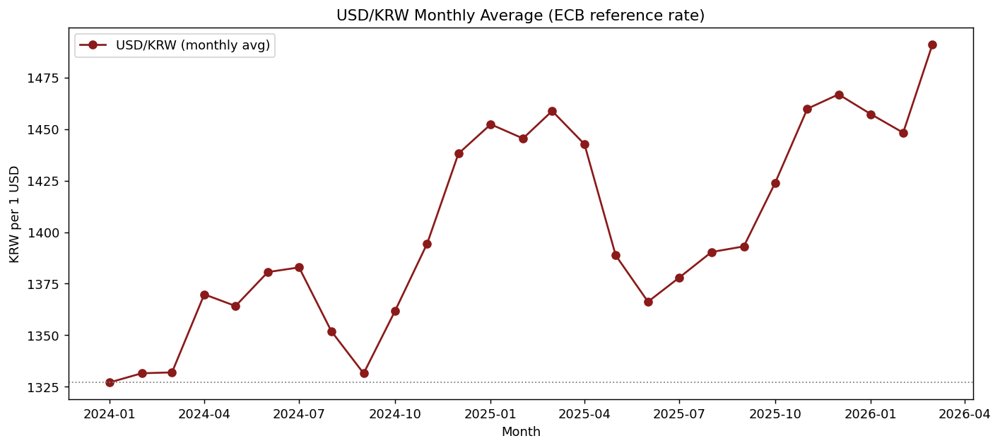
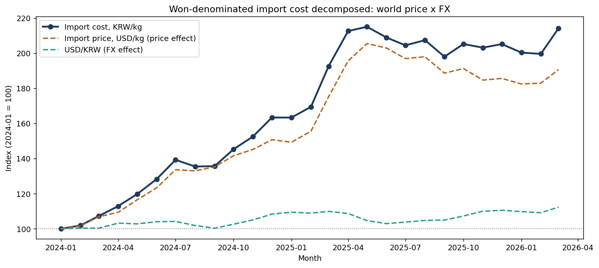

# Coffee & F&B Market Intelligence — Monthly Brief

**발행호:** 2026년 5월호 · **버전:** `v0` (FROZEN) · **data-cut:** 수입 2026-04 / 국제가격 2026-03 / 환율 2026-05
**작성:** jaeahn91 · **상태:** Section 1~7 전 구간 작성 완료 · Section 6 국내 전가는 가설 단계(v1에서 데이터 검증 예정)

> *버전 체계:* **버전(v0/v1…)** = 분석이 답한 *질문*의 성숙도, **data-cut** = 반영된 데이터 시점. 둘은 별개 축이다(월 데이터 추가 ≠ 버전업). 버전별 답한 질문은 `docs/CHANGELOG.md` 참조.

> 본 리포트는 한국 커피 시장의 월간 동향을 수입통계·국제시세 등 1차 데이터로 정리하고
> 비즈니스 의사결정 관점의 함의를 도출한다. 데이터 출처와 한계는 각 섹션 말미에 명시한다.

---

## 1. Executive Summary

**핵심 메시지:** 한국의 생두 수입 원가는 원화 기준으로 측정 구간 동안 **약 2배(5,150 → 11,030원/kg)**가 됐다. 이 충격의 본체는 국내 조달이 아니라 **외생 요인** — 국제 아라비카 시세 상승(기여 ~85%)에 원화 약세(~15%)가 얹힌 결과다. 더 중요한 것은, 2025년 중반 이후 **국제 시세가 정점에서 내려오는데도 환율이 그 하락분을 상쇄해 원화 원가가 고점에 고착**됐다는 점이다. 이 비용은 국내 F&B로 전가되되, **저가 프랜차이즈와 스페셜티 로스터라는 양극단에 가장 날카롭게** 작용할 것으로 보인다.

**주요 발견**

1. **수입은 가격이 끌어올렸다, 물량이 아니라.** 생두 수입 *물량*은 월 13,700톤 안팎으로 정체된 반면 *금액*은 크게 늘었다. 평균 수입 단가는 $3.88 → 정점 $7.98 → $6.87/kg로 움직였다. 즉 비용 증가의 동인은 **물량이 아니라 단가**다. (→ Section 2)
2. **단가 급등은 국제 아라비카 시세와의 동행이다.** 수입 단가는 아라비카와 레벨 상관 0.87로 함께 *상승*했으나, 월별 등락까지 동조하지는 않는다(차분 상관 0.08). 인과가 아닌 **구조적 동행**으로, 통제권이 국내에 없다. (→ Section 3)
3. **환율은 2차 증폭이지만 결정적 국면에 작동했다.** USD/KRW는 +12.3% 약세. 기여도는 15%에 불과하나, 2025-05 시세 정점 이후 **USD 단가가 −7.2% 빠지는 동안 원가는 −0.4%로 사실상 불변** — 환율이 가격 하락의 혜택을 지웠다. (→ Section 4)
4. **총량은 평탄해도 공급은 빡빡하다.** 원산지는 상위 4개국(브라질·베트남·콜롬비아·에티오피아)에 ~79% 집중. 에티오피아는 수입 총량상 정상(+13% YoY)이지만, 그 이면에서 **2026 뉴크롭 워시드의 도착 지연·선계약 집중**이 진행 중이며 4월 단가 프리미엄 +$1.07이 그 신호다. (→ Section 5)
5. **생두값 2배가 커피값 2배는 아니다.** 잔당 생두 원가 증가분은 **약 +100원/잔** — 프리미엄 한 잔에는 ~2%지만 **1,500원 저가 아메리카노에는 ~7%**다. 동일 충격이 시장 분포의 **양극단에 비대칭적으로** 통증을 준다. (→ Section 6, *가설 단계*)

**비즈니스 함의:** 비용 충격의 상당 부분이 외생(시세+환율)인 이상, 국내 사업자가 쥔 레버는 조달이 아니라 **메뉴·가격·구성 설계**다. 그리고 환율이 원가를 고점에 붙들어 두는 한, 국제 시세가 일부 진정돼도 국내 원가 압박은 쉽게 풀리지 않는다. 구조조정의 신호는 평균 지표가 아니라 **저가·스페셜티 양극단에서 먼저** 나타날 가능성이 높다(→ Section 7 트리거).

> **본 v0의 신뢰 범위:** 자체 1차 데이터로 검증된 부분(Section 2 수입, Section 3 가격, Section 4 환율, 관세청·FRED·ECB)과, 업계 현장 보도에 기반한 부분(Section 5 에티오피아), 그리고 **아직 국내 1차 데이터로 검증되지 않은 가설 부분(Section 6 국내 전가)**의 신뢰 수준은 다르다. Section 6과 Section 7-B는 메커니즘·가설이며, 다음 사이클의 데이터 수집(프랜차이즈 실판매가·서비스업동향·커피 CPI)으로 검증할 항목이다.

---

## 2. Green Bean Import Trend (생두 수입 동향)

**한 줄 요약:** 최근 28개월간 한국의 생두 수입 *물량*은 큰 추세 없이 정체된 반면 수입 *금액*은 뚜렷이 증가했다(측정 구간에 따라 +47~65%). 증가분은 더 많이 사들여서가 아니라 **단가 상승**이 만든 것이다.

### 2.1 수입 물량 — 정체

2024년 1월~2026년 4월 한국의 생두(HS 090111, 볶지 않은 커피) 수입 물량은 월 **10,600~16,900톤** 범위에서 등락했고 평균은 약 **13,700톤/월**이다. 월별 변동(변동계수 약 15%)은 있으나 뚜렷한 방향성은 약하다. 다만 연도별 월평균으로 보면 2024년 14,112톤/월 → 2025년 13,952톤/월로 보합, 2026년은 1~4월만으로 12,011톤/월이어서(연중 일부라 직접 비교는 주의) **소폭 둔화 가능성**을 배제하지 않는다. 생두는 재고 비축이 가능한 품목이므로 특정 월의 수입량이 곧 그 달의 소비량은 아니며, 월별 물량의 출렁임은 소비 변화라기보다 재고·계약·통관 타이밍의 결과로 보는 것이 타당하다.

### 2.2 수입 금액·단가 — 가격이 끌어올렸다

같은 기간 월 수입 **금액**은 약 **6,370만 → 9,350만 달러로 증가**했다(단일월 끝점 기준 +47%, 첫·마지막 3개월 평균 기준 +65% — 측정 구간에 따라 다름). 물량이 크게 늘지 않았으므로 이 증가는 **주로 평균 수입 단가** 상승에서 나왔다.

평균 단가(= 수입금액 ÷ 수입중량)는 **2024년 1월 $3.88/kg → 정점 $7.98/kg(약 2배) → 2026년 4월 $6.87/kg**로 움직였다. 단가를 따로 떼어내면 "물량 효과"와 "가격 효과"를 분리해 볼 수 있는데, 이 분해는 명확한 방향을 가리킨다 — **수입 비용 증가의 주된 동인은 가격이다.** 다만 평균 단가는 모든 원산지·등급을 합친 *혼합 단가*이므로, 순수 가격 효과 외에 **원산지 구성 변화**도 일부 섞여 있다. 실제로 최대 원산지 브라질의 물량 비중은 2024-01 약 40%에서 2026-04 약 30%로 낮아졌다(구성효과 존재). 따라서 단가 상승은 "전적으로 가격"이라기보다 **'주로 국제 시세, 일부 구성 변화'**로 읽는 것이 정확하다.

*그림 2-1. 막대(물량, 톤)는 평탄, 선(평균 단가, USD/kg)은 우상향. 금액 증가는 가격이 견인.*

### 2.3 원산지 구조 — 상위 4개국 집중

누적 물량 기준 상위 원산지는 **브라질 33.9% · 베트남 16.7% · 콜롬비아 16.5% · 에티오피아 12.2%**로, 상위 4개국이 전체의 약 **79%**를 차지한다(총 85개 수입국 중). 공급이 소수 국가에 집중돼 있어, 이들 산지의 기후·수확·물류 이슈가 한국의 수입 물량과 단가에 빠르게 전달될 수 있다. (→ Section 5 공급 리스크에서 추적)

*그림 2-2. 상위 4개국이 전체 물량의 ~79%. 원산지 집중도 높음.*

> **데이터 출처·검증:** 관세청 OpenAPI(data.go.kr), HS 090111, 2024-01~2026-04 / 1,082행·28개월.
> 무결성 검증 통과(중복 0·음수 0·결측 0, 월 33~47개국). API 합계행과 국가합 교차검증 일치(2024-01 기준 오차 2kg).
> **한계:** HS 090111은 아라비카/로부스타 종을 구분하지 않는다(혼합 단가).

---

## 3. International Coffee Price Trend (국제 커피 가격 동향)

**한 줄 요약:** Section 2에서 본 수입 단가 급등은 국내 요인이라기보다 **국제 아라비카 시세의 구조적 상승과 같은 방향으로** 진행됐다. 수준은 함께 움직이나(레벨 상관 0.87) 매월 등락까지 동조하는 것은 아니므로(차분 상관 0.08), 인과가 아닌 **동행 관계**로 해석한다.

### 3.1 국제 시세 — 2024~25년 구조적 급등

FRED(IMF Primary Commodity Prices) 기준, 국제 **아라비카(Other Milds)** 가격은 **2024년 1월 $4.50/kg → 정점 $9.03/kg**까지 약 2배 급등한 뒤 $7대로 일부 조정됐다. **로부스타**는 $3~5/kg대에서 등락했다. 두 시세 모두 2024~25년에 걸쳐 구조적으로 상승했으며, 통상 브라질 가뭄과 베트남 공급난이 배경으로 지목된다.

*그림 3-1. 아라비카(갈색)·로부스타(초록) 모두 2024~25년 구조적 상승.*

### 3.2 교차검증 — 한국 수입 단가 ≈ 아라비카 시세

한국 수입 단가(전 원산지 평균)를 동일 단위(USD/kg)로 환산해 국제 시세 위에 겹쳐 보면:

- 수입 단가는 **아라비카와 (레벨) 상관계수 0.87**, 로부스타와는 0.26 → 수입 비용의 **수준은 아라비카 시세대와 함께 움직인다.**
- 단, 이 0.87은 두 시계열이 **같은 기간 함께 상승한 공통 추세**를 크게 반영한다. 추세를 제거하고 **월별 변화(전월 대비)**만 보면 상관은 **0.08로 떨어진다.** 즉 **장기적으로 같은 방향으로 상승**하지만 **매월의 등락까지 동조하지는 않는다.** ("아라비카가 단기적으로 단가를 끌어당긴다"는 해석은 데이터로 뒷받침되지 않음.)
- 수입 단가는 아라비카보다 평균 **$0.93/kg 낮다.** 이는 상대적으로 저렴한 로부스타(베트남)·브라질 내추럴 등이 혼합된 결과로 해석된다.
- 2026년 3월 기준 수입 단가 **$7.40/kg**는 아라비카 **$7.37/kg**에 근접했다(최근 시점에서 격차 축소. 단, 단일 시점 근접이므로 추세로 단정하기보다 관찰로 봄).

*그림 3-2. 한국 수입 단가(남색)가 아라비카(갈색)에 밀착해 동행. 로부스타(초록)와는 괴리.*

### 3.3 비즈니스 함의

한국 커피 수입 단가의 급등은 **국제 아라비카 시세의 구조적 상승과 같은 방향·비슷한 폭**으로 진행됐다. 즉 비용 상승의 상당 부분은 국내 조달 방식이 아니라 **세계 시세라는 외생 요인**으로 설명되며(원산지 구성 변화가 일부 가세), 그 통제권이 국내에 있지 않다는 점이 핵심이다. 이는 곧 국내 F&B(카페·프랜차이즈)의 원가 압박으로 이어진다(→ Section 6). 또한 달러 표시 시세에 환율이 얹히면 원화 기준 원가는 추가로 영향을 받으므로, 이 비용 충격의 실제 크기는 Section 4(FX)와 함께 봐야 완성된다.

> **데이터 출처:** FRED — `PCOFFOTMUSDM`(아라비카 Other Milds), `PCOFFROBUSDM`(로부스타). 원자료 US 센트/lb → USD/kg 환산(×0.0220462).
> 기간 2024-01~2026-03(27개월). **한계:** FRED는 IMF 가공 월간 시세로, 향후 ICO I-CIP를 권위 소스로 추가 교차검증 예정.
> **방법론 한계:** 상관계수는 추세를 공유하는 시계열에서 부풀려질 수 있어(허위상관), 레벨 상관(0.87)과 차분 상관(0.08)을 함께 봐야 한다. 인과가 아닌 동행 관계로 해석한다.

---

## 4. FX Impact (환율 영향)

**한 줄 요약:** 원화 기준 수입 원가는 측정 구간 동안 약 **2배(5,150 → 11,030원/kg)**로 뛰었다. 이를 분해하면 상승분의 **약 85%는 국제가격(달러), 약 15%는 환율(원화 약세)**에서 나왔다. 즉 'price + FX'의 **이중 압박**은 실재하지만 두 힘은 대등하지 않다 — 환율은 **주된 동인이 아니라 2차 증폭 요인**이다. 다만 그 증폭은 결정적인 국면에 작동했다.

### 4.1 환율 — 추세적 원화 약세, 단 단조롭지 않음

USD/KRW 월평균(ECB 기준환율)은 **2024년 1월 1,327원 → 2026년 3월 1,491원으로 +12.3%** 상승(원화 약세)했다. 다만 직선이 아니다. 2024년 말~2025년 초 1,450원대로 약세가 진행됐다가 **2025년 6월 1,366원까지 되돌림(원화 강세)**, 이후 다시 약세로 돌아 2025년 말~2026년 초 1,460~1,490원대에서 움직였다. 이 비단조성은 뒤에서 보듯 원가에 시기별로 다른 방향의 힘으로 작용했다.

*그림 4-1. USD/KRW 월평균. 추세는 원화 약세(우상향)이나 2025년 중반 일시 강세 구간 존재.*

### 4.2 이중 비용 압박의 분해 — 주로 가격, 일부 환율

원화 기준 수입 원가는 `원가(KRW) = 수입단가(USD) × 환율(KRW/USD)`로 정의된다. 이 곱은 로그로 보면 정확히 더해지므로, 원가 변화를 **가격 효과**와 **환율 효과**로 깔끔하게 나눌 수 있다.

- 원화 수입 원가: **5,150원/kg(2024-01) → 11,030원/kg(2026-03), +114%** (단일월 끝점 기준; 첫·마지막 3개월 평균 기준으로는 +99%).
- 이 상승의 **기여도는 가격 ~85% · 환율 ~15%**(두 기준에서 일관). 같은 기간 달러 단가는 +90.6%, 환율은 +12.3% 올랐다.
- 따라서 **원가 폭등의 본체는 국제 아라비카 시세(→ Section 3)이며, 환율은 그 위에 얹힌 비교적 얇은 층**이다. "환율 때문에 원가가 폭등했다"는 서술은 데이터로 과장이다.

*그림 4-2. 2024-01=100 지수. 남색(원화 원가)은 갈색(달러 단가)을 환율(청록)만큼 들어올린 것. 갈색·남색의 간격이 환율 기여분으로, 후반부로 갈수록 벌어진다.*

### 4.3 환율이 결정적이었던 국면 — "가격 하락분을 환율이 상쇄했다"

기여도 15%라는 평균값은 환율의 역할을 과소평가하게 만들 수 있다. **시점을 좁히면 환율은 결정적이었다.** 달러 수입 단가는 **2025년 5월 $7.98/kg로 정점**을 찍은 뒤 2026년 3월 **$7.40으로 −7.2% 하락**했다. 그런데 같은 구간 환율이 **+7.4%(1,389 → 1,491원) 상승**하면서, **원화 원가는 11,077원 → 11,030원으로 사실상 −0.4%, 즉 거의 그대로**였다.

즉 **국제 시세가 정점에서 내려오는 동안 원화 구매자는 그 하락의 혜택을 거의 누리지 못했다** — 환율이 가격 하락분을 정확히 상쇄했기 때문이다. 환율은 원가를 *끌어올린* 주역은 아니지만, 원가를 *높은 수준에 붙들어 둔* 요인이다. 이 점이 **수입 기준 원가**가 2025년 이후 좀처럼 내려오지 않는 배경이며, 이 압박이 국내 F&B로 어떻게 전가되는지는 Section 6에서 다룬다.

> **데이터 출처:** ECB 기준환율(유럽중앙은행 일일 참조환율) — Frankfurter API, USD→KRW, 일자료를 월평균으로 집계. 스크립트 `scripts/fetch_fx.py`, 분석 노트북 `notebooks/03_fx_and_cost_decomposition.ipynb`, 처리 데이터 `data/processed/fx_and_cost_decomposition.csv`. 기간 2024-01~2026-03(달러 단가 시계열과 동일 구간). 참고로 환율 원자료는 2026-05까지 확보되어 있고, 4~5월에도 1,481·1,491원으로 높은 수준이 이어졌다.
> **방법론 한계:** (1) ECB 기준환율은 하루 한 번의 *참조 고시환율*로, 수입사가 실제 결제 시 적용받는 전신환매도율·스프레드·헤지 환율과 다르다 — 본 분해는 실제 헤지 원가가 아니라 **방향과 크기의 근사**다. (2) 생두는 선계약·신용장 결제가 일반적이어서 특정 월의 *현물* 환율이 곧 그 달 통관 물량에 적용된 환율은 아니다(타이밍 괴리). (3) 수입 단가는 전 원산지 혼합 단가이므로 Section 2의 '구성효과' 한계가 그대로 적용된다. 원래 권위 소스로 계획했던 FRED(DEXKOUS)는 수집 시점 접근 불가하여 동등 권위의 ECB로 대체했고, 향후 한국은행 고시환율로 교차검증 예정.

---

## 5. Origin and Supply Risk (원산지 공급 리스크)

**한 줄 요약:** 수입 통계상 에티오피아 물량은 정상이지만, 그 이면에서 **2026년 뉴크롭(특히 워시드)의 도착 지연·선계약 집중**이 진행 중이다. 통관 총량은 재고·내추럴로 메워지고 있어 평탄해 보이지만, 신선 뉴크롭·특정 등급 기준으로는 공급이 빡빡하다.

### 5.1 에티오피아 — 데이터는 정상, 현장은 빡빡 (수확연도 디테일)

본 리포트의 수입 통계(HS 090111, 전체 집계)로 보면 에티오피아 수입은 **끊긴 적 없고 2026년 1~4월 합계는 오히려 전년 대비 +13%** 다(→ Section 2.3, 부속 노트 `docs/origin_notes_ethiopia_2026q1.md`). 그러나 통관 총량은 종·등급·**수확연도**를 구분하지 못하므로, "신선 뉴크롭이 늦는다"는 현장 신호는 이 지표에 잡히지 않는다. 무역 매체 보도는 이 공백을 메운다:

- **도착 시점 시프트:** 2026년 첫 컨테이너가 **3월에 도착**, 통상 1월 출하 대신 **2~3월 선적**으로 밀렸다. 워시드는 3~6월, 남부 내추럴은 8~9월로 도착이 분산된다.[^c2c] → "1분기 초엔 안 보이다가 이제서야 들어온다"는 체감과 일치.
- **워시드 부족:** 농가가 현금 부족으로 체리를 집에서 건조(내추럴화)하면서, 한 수출사 기준 워시드 처리 비중이 **40~45% → 약 20%**로 급감. 예가체프류(주로 워시드) 신선 물량이 특히 빡빡하다.[^alg]
- **선계약·재고 집중:** 체리값이 **$0.45 → $1.51/kg(약 3배)**, 유기농 FOB 오퍼가 **~$5.60/lb**로 기록적 상승. 가격 급등이 **투기적 보유·조기 선계약**을 부추겨 "초기 컨테이너는 이미 완판" 상태.[^alg][^c2c] → "미리 계약해 쌓아둔다"는 이야기와 부합.
- **물류 리스크:** 동아프리카 항로 불안정(운임·전송시간 상승), 주요 선사의 컨테이너 부족·롤링 취소. **4월까지의 조기 수출 창**을 놓친 물량은 적체에 노출.[^c2c]

### 5.2 데이터 신호와의 연결

Section 2·단가 분석에서 남긴 **watch-item — 2026-04 에티오피아 단가 프리미엄 +$1.07 반등**(전체 평균은 하락하는데 ET만 $7.94 유지)은 위 체리값·FOB 기록적 상승과 방향이 일치한다. 즉 데이터의 미세 신호와 현장 뉴스가 같은 곳을 가리킨다. 5월 데이터에서 프리미엄이 이어지는지 확인 필요(→ Section 7 Watchpoint).

### 5.3 비즈니스 함의

원산지 상위 집중(상위 4국 ~79%, → Section 2.3) 구조에서, 특정 산지의 **품질·시즌 단위 공급 차질**은 총량 지표에 늦게/약하게 나타난다. 따라서 **총 수입량이 평탄하다는 사실만으로 "공급은 안전"이라 결론짓는 것은 위험**하다. 스페셜티·단일 원산지 비중이 높은 국내 로스터일수록 뉴크롭 지연·워시드 부족의 체감 충격이 크다.

> **출처·한계:** 아래 무역 매체(algrano, Crop to Cup)는 **업계 현장 리포트**로, 일부 수치(워시드 비중·FOB 등)는 **특정 수출사·수입사 기준의 예시**이며 국가 공식 통계가 아니다. 추세·정황 근거로 활용하되 단정은 피한다. 수입 물량/단가는 본 리포트 자체 통계(관세청)에서 산출.

[^alg]: algrano, "Ethiopia Coffee Harvest 2026: High cherry prices and a tighter washed outlook" — https://algrano.com/learn/ethiopia-coffee-harvest-report-2026
[^c2c]: Crop to Cup, "Ethiopia 2026: First Arrivals & Harvest Review" — https://www.croptocup.com/ethiopia-2026-first-arrivals-harvest-review/

---

## 6. Implications for Korean F&B Market (국내 F&B 시장 함의)

**한 줄 요약:** 생두 원가가 원화 기준 2배가 됐다고 해서 커피 한 잔 값이 2배가 되는 것은 아니다. 잔당 생두 원가 증가분은 **약 +100원/잔**으로, 프리미엄 한 잔(4,500~5,500원)에는 ~2%에 불과하지만 **저가 1,500원 아메리카노에는 ~7%**에 달한다. 즉 동일한 외생 충격이 **저가 박리다매 모델과 스페셜티 로스터에 가장 날카롭게**, 가운데 구간에는 비교적 완만하게 전달된다. (※ 본 섹션은 국내 가격·소비 1차 데이터 수집 전이라, 확인된 결과가 아니라 **비용 구조에서 도출한 메커니즘과 가설**이다.)

### 6.1 충격의 크기를 '잔당'으로 환산 — 2배 ≠ 2배

원가 충격을 평가하려면 도매 단가(원/kg)를 소비 단위(잔)로 내려야 한다. 더블샷 아메리카노 1잔에 생두 약 **16~20g**이 들어간다고 보면(로스팅 수율 손실 포함, 예시 가정):

| 항목 | 2024-01 | 2026-03 | 증가 |
|---|---|---|---|
| 생두 원가(원/kg, → Section 4) | 5,150 | 11,030 | +114% |
| **잔당 생두 원가(18g 기준)** | 약 93원 | 약 199원 | **약 +106원** |

잔당 생두 원가 증가분은 가정 폭(16~20g)을 줘도 **+90~120원** 범위다. 핵심은 **생두는 한 잔 원가의 일부일 뿐**이라는 점이다 — 여기에 로스팅 수율 손실·인건비·임대료·우유·부자재가 더해진다. 따라서 *생두값 2배*가 곧 *판매가 2배*는 아니며, 잔당 +100원 안팎의 투입 비용 상승을 각 사업자가 **가격·용량·품질·마진** 중 어디로 흡수하느냐의 문제로 바뀐다.

### 6.2 같은 충격, 다른 통증 — 플레이어별 노출도

+100원/잔이라는 절대액은 같아도, 판매가 대비 비중과 사업 모델에 따라 체감은 크게 갈린다.

- **저가 프랜차이즈(1,500원대 아메리카노 모델):** +100원은 판매가의 **약 7%**. 초저마진·대량판매 구조라 흡수 여력이 얇고, 1,500원이라는 상징적 가격선을 지키려는 압박이 커 **용량·블렌드 조정이나 부분 인상**으로 나타나기 쉽다. 가장 날카롭게 노출된 구간.
- **중가 프랜차이즈(3,000~3,500원대):** +100원은 **약 3%**. 메뉴 믹스(시즌 음료·디저트)로 분산 흡수할 여지가 상대적으로 큼.
- **프리미엄·대형(4,500~5,500원):** +100원은 **약 2%**. 브랜드 가격결정력과 선계약·헤지·규모의 경제로 단기 충격 완충이 가장 용이.
- **스페셜티 단일 원산지 로스터:** 가격 비중은 프리미엄과 비슷해도 **Section 5의 공급 측면 충격(뉴크롭 지연·워시드 부족)**이 겹친다. 즉 *가격*만이 아니라 *원하는 등급·로트의 가용성*까지 위협받아, 노출이 가격·물량 **양면**이다.

### 6.3 비용을 어디로 흘려보내나 — 전가 4레버

사업자가 +100원/잔을 처리하는 경로는 대체로 네 가지이며, 실제로는 혼합된다:

1. **판매가 인상(pass-through):** 가장 직접적. 단 저가 구간은 상징적 가격선 때문에 저항이 큼.
2. **용량·구성 축소(shrinkflation):** 잔 용량·원두 투입량 축소 등 '보이지 않는 인상'.
3. **블렌드 다운그레이드:** 상대적으로 싼 로부스타·브라질 내추럴 비중 확대 → Section 2의 *혼합 단가/구성효과*와 직접 연결(품질-원가 트레이드오프).
4. **마진 흡수:** 단기적으로 사업자가 떠안음 → 영업이익률 압박. Section 4에서 본 **'환율이 가격 하락분을 상쇄해 원가가 고점에 붙들려 있는'** 상황이 이 흡수 여력을 장기간 갉아먹는다.

### 6.4 함의와 검증해야 할 것

비용 충격의 **상당 부분이 외생(국제 시세 + 환율, → Section 3·4)**이라는 사실은, 국내 사업자가 통제할 수 있는 레버가 조달이 아니라 **메뉴·가격·구성 설계**에 있음을 뜻한다. 그리고 충격은 평균이 아니라 **분포의 끝(저가·스페셜티)**에서 먼저 터진다 — 시장 구조조정(저가 박리다매 모델의 수익성 악화, 스페셜티의 등급 확보 경쟁)은 평균 지표보다 이 양극단에서 먼저 관측될 가능성이 높다.

단, **위 메커니즘은 아직 국내 1차 데이터로 검증되지 않았다.** 다음을 수집해 가설을 사실로 굳혀야 한다(→ Section 7 Watchpoints):
- 프랜차이즈 **실판매가 변동**(저가/중가/프리미엄 구간별, 2024~2026)
- 카페·비알코올 음료점업 **소비·매출**(통계청 서비스업동향, 카드 소비 데이터 관련 보도)
- 외식 물가 중 **커피·음료 항목 CPI** 추이
- 가능하면 도매 **로스팅 원두 가격**(생두→로스티드 전가 시차·마진 확인)

> **출처·한계:** 본 섹션의 **국내 F&B 결과(가격 인상·소비 변화·마진)는 아직 1차 데이터로 수집·검증되지 않았다.** 잔당 환산은 생두 16~20g/잔·로스팅 수율 등 **공학적 예시 가정에 기반한 자릿수(order-of-magnitude) 추정**이며 실측 원가(COGS)가 아니다. 판매가 구간(1,500/3,000/4,500~5,500원)은 국내 커피 시장의 **일반적 가격대 구조**를 예시로 든 것으로, 특정 브랜드의 특정 시점 가격 변동을 주장하지 않는다. 생두 원가·환율은 본 리포트 자체 분석(Section 2·4)에서 산출.

---

## 7. Next Month Watchpoints (다음 달 관찰 포인트)

**한 줄 요약:** 아래 관찰 포인트는 "지켜보자"에 그치지 않도록 **판단 기준(트리거)**을 함께 적었다 — 다음 달(2026-05) 데이터가 들어왔을 때 각 가설이 *유지되는지/꺾이는지*를 숫자로 가를 수 있게 했다.

### A. 다음 달 데이터로 즉시 확인 (수입·가격·환율 갱신 시)

**A-1. 에티오피아 단가 프리미엄의 지속 여부** *(→ Section 5.2)*
- **신호:** 2026-04 ET 수입단가 $7.94/kg가 전체 평균($6.87)을 **+$1.07** 상회(공급 타이트의 데이터 흔적, Section 5의 체리값·FOB 급등과 동행).
- **판단 기준:** 5월 ET 프리미엄이 **+$0.8/kg 이상 유지 → 공급 타이트 지속** 신호. **0 근처로 수렴 → 4월 반등은 일시적**이었던 것으로 재해석.

**A-2. 환율의 '가격 하락분 상쇄' 지속 여부** *(→ Section 4.3)*
- **신호:** USD 시세가 정점에서 내려오는데도 원화 원가가 고점에 붙들려 있음(2025-05→2026-03 원가 −0.4%). 환율은 2026-04·05에도 1,481·1,491원으로 높음.
- **판단 기준:** 5월 USD 아라비카가 추가 하락하는데 USD/KRW가 **1,450원 이상 유지**되어 **원화 원가가 10,500원/kg 위에 머무르면 → FX 상쇄 지속**(국내 원가 경직). 환율이 1,400원 아래로 풀리며 원가가 동반 하락하면 → 압박 완화 시작.

**A-3. 수입 물량 둔화의 진위** *(→ Section 2.1)*
- **신호:** 2026년 1~4월 평균 약 12,011톤/월로 2024·25년(약 14,000)보다 낮음 — 다만 연중 일부.
- **판단 기준:** 5~6월도 **13,000톤/월을 밑돌면 → 실수요/재고 둔화** 가설 강화. **14,000톤 안팎으로 반등하면 → 통관·계약 타이밍**이었던 것(재고 보충). *생두는 stock-vs-flow* 특성상 단월 해석 금물(→ learning_notes).

**A-4. 원산지 구성 변화의 단가 영향** *(→ Section 2.2·2.3, 3.2)*
- **신호:** 브라질 물량 비중 2024-01 ~40% → 2026-04 ~30%(구성효과 존재). 혼합 단가가 '순수 가격'과 '구성 변화'를 섞고 있음.
- **판단 기준:** 브라질 비중이 더 내려가고 단가-아라비카 격차(평균 −$0.93)가 **축소 지속 → 구성 고급화/로부스타 비중 축소**. 격차가 다시 벌어지면 → 저가 원두로의 다운그레이드(Section 6.3 레버 3) 신호일 수 있음.

### B. 구조적·현장 관찰 (총량 지표에 늦게 잡히는 것)

**B-1. 워시드/뉴크롭 타이트의 해소 시점** *(→ Section 5.1)*
- 워시드 도착은 3~6월, 남부 내추럴은 8~9월로 분산. **6월까지 워시드 신선 물량이 들어오며 프리미엄·체리값이 진정되는지** 관찰. 스페셜티 단일 원산지 로스터일수록 체감 충격이 큼(가격+가용성 양면).

**B-2. 국내 전가의 실제 발생 — Section 6 가설의 검증** *(→ Section 6.4)*
- Section 6은 **메커니즘·가설** 단계. 다음 데이터로 사실 여부 확인 필요:
  - 프랜차이즈 **실판매가**(저가/중가/프리미엄 구간별, 2024~2026)
  - 통계청 **서비스업동향**(카페·비알코올 음료점 매출/소비)
  - 외식 물가 중 **커피·음료 CPI**
  - 도매 **로스팅 원두 가격**(생두→로스티드 전가 시차·마진)
- **가설 예측:** 충격은 평균이 아니라 **분포의 끝(저가 1,500원대·스페셜티)**에서 먼저 — 저가 구간 가격선 붕괴/용량 축소 신호가 먼저 관측되면 가설 지지.

### C. 방법론 강화 (다음 사이클 권위 소스 교차검증)

- **C-1. 가격:** ICO **I-CIP**(공식 지표)로 FRED 시세 교차검증 *(→ Section 3 한계)*.
- **C-2. 환율:** **한국은행 고시환율**로 ECB 기준환율 교차검증 — 실제 수입 결제환율과의 괴리 점검 *(→ Section 4 한계)*.

> **참고:** 위 트리거 임계값(예: +$0.8, 1,450원, 13,000톤)은 현재까지의 분포를 바탕으로 한 **1차 판단선**이며, 데이터가 쌓이면 재보정한다. 목적은 정확한 예측이 아니라 다음 달 관찰을 **검증 가능한 형태**로 만드는 것이다.
