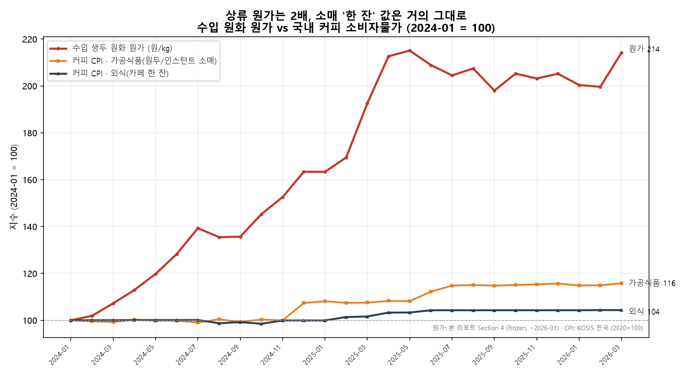

# Coffee & F&B Market Intelligence — Monthly Brief

**발행호:** 2026년 6월호 · **버전:** `v1` · **성격:** 트리거 검증호(Verification Issue)
**data-cut:** 수입·국제가격 2026-05 / 환율 2026-06(부분, 5영업일)
**작성:** jaeahn91 · **선행호:** [2026년 5월호 `v0`](monthly_coffee_market_brief_2026_05.md) (FROZEN)

> **이 호의 성격.** 짧다 — 그게 설계다. 5월호(v0)는 국내 전가(§6)와 공급 신호(§7)를 *가설*로 남기고, 다음 달 데이터로 판정할 수 있게 **검증 가능한 임계값(트리거)**을 스스로 걸어뒀다. 이 호는 새 데이터(2026-05)로 그 트리거를 **실제로 판정**하고, §6 가설을 국내 1차 데이터로 **처음 검증**한다. 새 리서치가 아니라, *걸어둔 약속을 데이터로 정산*하는 호다.
>
> *버전 체계:* 버전(v0/v1…)은 답한 *질문*의 성숙도, data-cut은 반영 데이터 시점 — 둘은 별개 축이다(상세: `docs/CHANGELOG.md`). v0 본문은 frozen이며, 본 호는 v0의 숫자를 수정하지 않고 그 위에서 판정한다.

---

## 1. Executive Summary

**이번 호가 답하는 것:** v0가 건 트리거는 실제 데이터로 어떻게 판정됐나 — 그리고 "생두값 2배"는 국내 소비자가로 전가됐나?

**판정 결과 — 세 트리거 모두 v0 가설과 같은 방향으로 확정(반증되지 않음):**

| 트리거 (5월호 §7) | 임계값 | 2026-05 실측 | 판정 |
|---|---|---|---|
| **A-1** 에티오피아 단가 프리미엄 | ≥ +$0.8/kg → 공급 타이트 지속 | **+$1.03/kg** (ET $8.10 vs 평균 $7.07) | ✅ **지속** (2개월 연속) |
| **A-2** 환율의 가격하락분 상쇄 | FX ≥ 1,450 & 원가 > 10,500원/kg | FX **1,491** · 원가 **10,542원/kg** | ✅ **지속** (FX가 흡수) |
| **A-3** 수입 물량 둔화 | < 13,000톤/월 → 실수요/재고 둔화 | **11,411톤** (2026 평균 11,891) | ✅ **둔화 강화** |

**핵심 메시지 — 반증 가능성은 말이 아니라 실행이었다.** 세 트리거 모두 다음 달 데이터가 *"계속 지켜보자"*가 아니라 **숫자로 정산**했다. 상류(원산지·물량·환율)의 그림은 한 달 뒤에도 유지된다 — 에티오피아 공급은 여전히 타이트하고, 물량 둔화는 4월의 반등이 일시적이었음을 확인했으며, 환율은 국제 시세가 정점에서 −20% 빠지는 동안에도 원화 원가를 고점에 붙들고 있다.

**그리고 처음으로 국내가 데이터에 붙었다:** 통계청 CPI로 §6을 검증한 결과, 상류 원화 원가 **+114%** 동안 소비자가 실제 내는 **외식 커피 물가는 +4.4%** — v0의 명제 *"생두값 2배 ≠ 판매가 2배"*가 데이터로 성립했다(→ §4). 남은 공백은 **가격대별 비대칭**(저가 vs 프리미엄)으로, 집계 CPI로는 분해되지 않아 다음 호로 넘긴다.

---

## 2. Trigger Verdicts — 5월호 §7 판정

> 모든 실측값은 raw 데이터(관세청 수입·FRED 가격·ECB 환율)에서 직접 산출했으며, Day 7 정산 기록과 일치한다. 계산 방식은 v0 본문 §2~§4와 동일.

### A-1. 에티오피아 단가 프리미엄 — ✅ 지속 (2개월 연속) *(→ v0 §5.2)*

2026-05 에티오피아 수입 단가는 **$8.10/kg**로 전체 평균 단가 **$7.07/kg**을 **+$1.03/kg** 상회했다. 임계값(+$0.8) 위에서 **두 달 연속**(4월 +$1.07 → 5월 +$1.03) 유지된다. 즉 **4월의 프리미엄 반등은 노이즈가 아니었다** — v0 §5가 짚은 체리값·FOB 기록적 상승(뉴크롭 워시드 도착 지연·선계약 집중)과 방향이 일치하는 공급 타이트 신호가 지속되고 있다. ET 수입 물량 자체는 1,610톤으로 통관은 끊기지 않았다(총량 정상, 단가에만 타이트가 잡힘 — v0 §5.1의 "데이터는 정상, 현장은 빡빡"이 재연).

*한계:* HS 090111 혼합 단가는 종·등급·수확연도를 구분하지 못하므로, 이 프리미엄은 워시드 부족의 *방향 일치 신호*이지 증명이 아니다. 5월 통관치는 잠정일 수 있다.

### A-2. 환율의 '가격 하락분 상쇄' — ✅ 지속 *(→ v0 §4.3)*

v0의 가장 반직관적인 발견 — *국제 시세가 내려도 원화 구매자는 그 혜택을 못 받는다* — 이 한 달 더 유지됐다. **2025-05 달러가격 정점 → 2026-05** 구간:

| | 2025-05 (정점) | 2026-05 | 변화 |
|---|---:|---:|---:|
| 국제 아라비카 (세계 벤치마크, USD/kg) | 8.77 | 7.00 | **−20.1%** |
| 한국 수입 단가 (혼합, USD/kg) | 7.98 | 7.07 | −11.3% |
| USD/KRW (월평균) | 1,389 | 1,491 | **+7.4%** |
| **원화 수입 원가** (= 수입단가 × 환율, 원/kg) | 11,076 | 10,542 | **−4.8%** |

세계 아라비카가 **−20%** 빠지는 동안 한국의 실제 원화 원가는 **−4.8%**만 내렸다. 원화 원가는 *혼합 수입단가 × 환율*로, 수입단가가 −11.3% 내렸어도 환율이 **+7.4%** 오르며 하락분의 대부분을 되먹었기 때문이다 — 세계 시세의 안도가 원화 구매자에게 거의 도달하지 못했다는 v0 §4.3의 발견이 한 달 더 유지된다. 트리거 두 조건(FX ≥ 1,450 **그리고** 원가 > 10,500원/kg)이 5월에 함께 충족됐다(1,491 & 10,542원). 6월 환율은 부분 집계로 **1,526원**까지 더 올라(원화 약세 심화) 완화 조짐은 아직 없다.

*정직한 관찰:* 원가 10,542원은 임계선 10,500을 *간신히* 넘었다 — 바로 전월 4월은 10,178원으로 임계선 **아래**였다. 즉 원화 원가는 임계선 근처에서 진동하며 **완만한 하락 추세**에 있다(정점 대비 −4.8%). 트리거는 "FX 상쇄가 여전히 작동 중"까지를 말하며, "원가가 다시 치솟는다"를 뜻하지 않는다. 압박 *방향*은 완화 쪽으로 기울기 시작했으나, 아직 임계선 위다.

### A-3. 수입 물량 둔화 — ✅ 둔화 강화 *(→ v0 §2.1)*

2026-05 수입 물량은 **11,411톤 < 13,000톤** 임계선. 2026년 월평균(1~5월)은 **11,891톤**으로 2024년 14,112 / 2025년 13,952 대비 뚜렷이 낮다. v0 §7이 지목했던 **4월의 13,610톤 반등은 고립된 튐**이었고 추세 반전이 아니었다 — 5월이 다시 임계선 아래로 내려오며 둔화 가설을 강화했다.

*한계:* 생두는 재고 비축이 가능한 stock-vs-flow 품목이라 단월 물량이 곧 소비는 아니다(→ `docs/learning_notes.md`). 다만 이제 **5개월 연속** 저수준이라 계약·통관 타이밍만으로 설명하기는 어려워졌다.

### A-4. 원산지 구성 효과 *(→ v0 §7 A-4, 참고)*

이번 호는 물량·단가·환율·CPI에 집중하고, 원산지 구성(브라질 비중 변화)의 단가 영향 재계산은 processed 레이어 재생성이 필요해 다음 사이클로 이월한다. (v0 §7 A-4는 미판정으로 남는다 — 이 호에서 다루지 않았음을 명시.)

---

## 3. Data Update (2026-05 델타)

> v0 §2~§4의 시계열을 2026-05로 한 달 연장한 요약. 방법론·차트·전체 해석은 v0 본문 참조(본 호는 델타만).

| 지표 | v0 data-cut | **2026-05** | 비고 |
|---|---:|---:|---|
| 수입 물량 (톤/월) | 13,610 (2026-04) | **11,411** | 임계선 아래 복귀(→ A-3) |
| 수입 평균 단가 (USD/kg) | 6.87 (2026-04) | **7.07** | 소폭 반등 |
| 국제 아라비카 (USD/kg) | 7.37 (2026-03) | **7.00** | 정점 대비 하락 지속 |
| USD/KRW (월평균) | 1,491 (2026-05*) | **1,526** (2026-06 부분) | 원화 약세 심화 |
| 원화 수입 원가 (원/kg) | 11,030 (2026-03) | **10,542** | 정점 대비 −4.8%(→ A-2) |

*v0는 환율 원자료를 2026-05까지 확보했으나 원가 분해는 2026-03에서 frozen. 위 원화 원가 10,542원은 2026-05 수입단가 × 2026-05 환율을 raw에서 직접 산출한 값이다.

**한 줄 해석:** 상류 그림은 v0에서 바뀌지 않았다 — 물량은 더 둔화, 국제가격은 하락 지속, 그러나 환율이 그 하락을 상쇄해 원화 원가는 여전히 만원대 고점권. 새 달 데이터는 v0의 구조적 서술을 흔들지 않고 *강화*한다.

---

## 4. 국내 전가 검증 — 커피 CPI (신규 · §6 evidence)

> v0 §6(국내 F&B 전가)은 *가설*이었다 — 잔당 생두 원가 ~+100원이라는 비용 메커니즘만 있고 국내 소매 데이터가 없었다. 이 호에서 **처음으로 국내 1차 데이터(통계청 CPI)**를 붙인다. 근거 노트: `docs/domestic_passthrough_cpi_2026.md`.

### 4.1 감쇠 사다리 — 상류에서 하류로 갈수록 충격이 희석된다

통계청 소비자물가지수(전국)로 §6 가설의 핵심을 데이터에 붙였다. **2024-01 = 100 지수** (공통 창 2024-01→2026-03, 원가 계열이 v0 frozen이라 여기서 끊음):

| 계열 | 2024-01 | 2026-03 | 증감 |
|---|---:|---:|---:|
| 수입 생두 **원화 원가** (원/kg) | 100 | **214** | **+114%** |
| 커피 CPI · **가공식품**(원두·인스턴트 소매) | 100 | **116** | **+15.8%** |
| 커피 CPI · **외식**(카페 한 잔) | 100 | **104** | **+4.4%** |

**원가 +114% → 원두 소매 +16% → 외식 한 잔 +4%.** 소매 단계로 내려올수록 상류 충격이 급격히 희석된다. 외식 커피는 2026-06까지 봐도 111.58(**+4.4%**)로 사실상 동일 — 최근 데이터가 결론을 바꾸지 않는다.

*그림 4-1. 원가(빨강)는 2배로 치솟지만 외식 '한 잔'(남색)은 거의 평탄. 2024-01=100 인덱스.*

### 4.2 메커니즘과 정량적으로 부합 — "2배 ≠ 2배" 확인

v0 §6.1은 생두가 한 잔 판매가의 **~2%(프리미엄)~7%(저가)**라고 봤다. 생두 원가 +114%가 *그 성분만* 온전히 전가되면 잔값은 대략 `1.14 × 비중` = **+2.3%~+8.0%** 오른다. 실측 집계값 **+4.4%는 이 구간 안**에 정확히 든다 → 관측된 소폭 상승은 *"생두는 한 잔 원가의 작은 조각"*이라는 v0 산식과 **정량적으로 부합**한다. 중간 단계 가공식품 커피가 +16%로 더 오른 것도 원두 소매의 생두 비중이 카페 한 잔보다 높기 때문 — v0 §6.2의 "노출도 = 판매가 대비 생두 비중"과 방향이 같다.

**전가의 형태:** 외식 CPI는 2024년 내내 ~106–107 평탄 → **2025년 상반기 1회성 계단(+4%p)** → 이후 2025-07~2026-06 내내 111.4x로 재차 평탄. 상류 원가를 *연속 추종*하는 게 아니라, 2024년 원가 급등을 **6~12개월 시차로 반영한 메뉴가 개정 물결** 뒤 고착된 형태다(메뉴가 경직성).

### 4.3 이 데이터로 하면 **안 되는** 해석 (과장 방지)

- **집계지수 ≠ 순수 생두 전가.** 외식 커피 CPI엔 매장유형 믹스·우유·인건비·임대료 등 비(非)생두 원가가 섞여 있다. 이들도 같은 기간 올랐으므로 +4.4%를 100% 생두 전가로 읽을 수 없다 — 생두분(分) 전가는 오히려 이보다 작을 수 있다. 데이터가 말하는 것은 **"2배가 판매가로 오지 않았다"까지**이며, "마진 흡수를 입증했다"는 과장이다.
- **가격대 분해 불가.** 집계라 저가/중가/프리미엄 구간을 나눌 수 없다 → v0 §6.2의 **"저가·스페셜티 양극단 비대칭"은 여전히 미검증**. 프랜차이즈 구간별 실판매가가 남은 최대 공백이다(→ §5).

---

## 5. Next Month Watchpoints (갱신)

**해소/정산된 것 (이 호에서 판정 완료):**
- ✅ A-1 ET 프리미엄 지속 · A-2 FX 상쇄 지속 · A-3 물량 둔화 강화 — 세 가설 모두 데이터로 확정.
- ✅ §6 국내 전가 "2배 ≠ 2배" — CPI로 방향 확인.

**계속 관찰 (아직 열림):**
- **B-1. FX 상쇄의 반전 시점** *(→ A-2)*: 원화 원가가 임계선(10,500원) 근처에서 진동 중, 정점 대비 −4.8%로 완만한 하락. 6월 환율 1,526원(약세 심화)이 이 하락을 다시 되돌리는지 vs 국제 시세 추가 하락이 이겨 원가가 10,500 아래로 내려오는지 — **다음 달이 방향을 가른다.**
- **B-2. 워시드/뉴크롭 타이트 해소** *(→ A-1, v0 §5)*: 워시드 도착은 3~6월. 6~7월 데이터에서 ET 프리미엄이 0으로 수렴하기 시작하면 신선 물량 정상화 신호.

**신규 트리거 (이 호가 새로 건 것):**
- **C-1. 가격대별 전가 비대칭** — §4가 확인한 +4.4%는 *집계*값이다. v0 §6.2의 예측(저가 1,500원대는 +7%로 날카롭게, 프리미엄은 +2%로 완만하게)을 검증하려면 **프랜차이즈 구간별 실판매가(저가/중가/프리미엄, 2024~2026)**가 필요하다. *판단 기준:* 저가 체인 아메리카노 표시가 인상률이 프리미엄 대비 유의하게 높으면(또는 용량 축소가 저가에서 먼저 관측되면) 비대칭 가설 지지. → **v1 잔여 최대 과제.**

**방법론 강화 (이월):** ICO I-CIP(가격)·한국은행 고시환율(FX) 권위 소스 교차검증은 다음 사이클 유지.

---

> **데이터 출처·검증:** 수입 = 관세청 OpenAPI(HS 090111, 2024-01~2026-05), 국제가격 = FRED(IMF), 환율 = ECB 기준환율(Frankfurter API), CPI = 통계청 KOSIS(`DT_1J22112`, 전국). 본 호의 모든 2026-05 수치는 raw 데이터에서 직접 재산출했으며, Tier-1 무결성 가드(`validate_data.py`)와 Tier-2 골든 가드(`check_figures.py`) 통과 상태에서 발행. v0 골든 13개는 이 호에서 변동 없음(새 달 추가가 과거 수치를 바꾸지 않음을 데이터 하네스가 확인).
> **한계 승계:** v0 §2~§6의 방법론 한계(혼합 단가·ECB 기준환율의 결제환율 괴리·잔당 환산의 order-of-magnitude 성격·CPI 집계효과)가 그대로 적용된다. 상세는 v0 본문 각 섹션 말미 참조.
